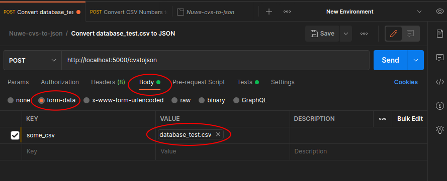

<div id="top"></div>

[](https://www.codefactor.io/repository/github/mariano-farace/nuwe-csv-to-json)
<!-- PROJECT SHIELDS -->
<!--
*** I'm using markdown "reference style" links for readability.
*** Reference links are enclosed in brackets [ ] instead of parentheses ( ).
*** See the bottom of this document for the declaration of the reference variables
*** for contributors-url, forks-url, etc. This is an optional, concise syntax you may use.
*** https://www.markdownguide.org/basic-syntax/#reference-style-links
-->


<!-- PROJECT LOGO -->
<br />
<div align="center">


<h3 align="center">Nuwe-csv-to-json</h3>

  <p align="center">
    A service to convert CSV files to JSON.
    <br />
    <a href="https://github.com/mariano-farace/Nuwe-CSV-to-JSON"><strong>Explore the docs »</strong></a>
  </p>
</div>


<!-- ABOUT THE PROJECT -->
# About The Project


Nuwe-csv-to-json is a CSV to JSON service made to participate at Red Cross's BCN Inclusive Coding Hackathon. The purpose of the app is to provide let the user upload a CSV file and return a JSON with numbers parsed as such.

<p align="right">(<a href="#top">back to top</a>)</p>


### Built With:

* <b>Node.js</b>
* <b>Express</b>
* <b>[multer](https://www.npmjs.com/package/multer)</b>  Middleware for handling multipart/form-data, used for uploading files.
* <b>[csvtojson](https://www.npmjs.com/package/csvtojson)</b> CSV parser to convert csv to json
  

### Development dependencies:

* <b>[nodemon](https://www.npmjs.com/package/nodemon) </b> Tool that automatically restarts the node application when file changes in the directory are detected
* <b>[eslint](https://www.npmjs.com/package/eslint) </b> Tool for identifying and reporting on patterns found in ECMAScript/JavaScript code
* <b>[eslint-config-airbnb-base](https://www.npmjs.com/package/eslint-config-airbnb-base) </b>Provides Airbnb's code style to be enforced by eslint 
  
<p align="right">(<a href="#top">back to top</a>)</p>


<!-- GETTING STARTED -->
# Getting Started

### Prerequisites

* Clone the repo
   ```sh
   git clone https://github.com/mariano-farace/Nuwe-CSV-to-JSON
   ```
* Have node v16 or higher
### Installation

1. At the root folder install NPM packages
   ```sh
   npm install
   ```
2. Rename  `template.env` to `.env`
   
3. Run the server. Will run on port 5000. Use dev version for nodemon
   ```sh
   npm start || npm run dev
   ```


# API Documentation
This API uses `POST` request to communicate and HTTP [response codes](https://en.wikipedia.org/wiki/List_of_HTTP_status_codes) to identify status and errors.

## Transform a CSV to JSON
Will transform an uploaded CSV to JSON.

**You send:**  A .CSV file.

**You get:** A response with a message and the resulting JSON as data.

**Request:**
```json

HEADERS

POST /cvstojson HTTP/1.1
Content-Type: multipart/form-data
Content-Length: xy

body:
some_csv: data.csv
```
**data.csv:**
```
id,firstname,lastname,salary,profession,age
535,Susette,Fancie,25862.22,police officer,36
158,Brooks,Timon,51312.86,doctor,68
957,Cyndie,Kare,54466.18,firefighter,62
```
**Successful Response:**
```json
HTTP/1.1 200 OK
Content-Type: application/json
Content-Length: xy
body:
{
    "message": "file transformed successfully",
    "data": [
        {
            "id": 535,
            "firstname": "Susette",
            "lastname": "Fancie",
            "salary": 25862.22,
            "profession": "police officer",
            "age": 36
        },
        {
            "id": 158,
            "firstname": "Brooks",
            "lastname": "Timon",
            "salary": 51312.86,
            "profession": "doctor",
            "age": 68
        },
        {
            "id": 957,
            "firstname": "Cyndie",
            "lastname": "Kare",
            "salary": 54466.18,
            "profession": "firefighter",
            "age": 62
        }
    ],
    "errors": []
}
```
**Fail Responses:**
```json
HTTP/1.1 400 Bad Request
Content-Type: application/json
Content-Length: xy

{
    "message": "No file provided for upload.",
    "data": {},
    "errors": "No file provided for upload."
}
``` 

```json
HTTP/1.1 400 Bad Request
Content-Type: application/json
Content-Length: xy

{
    "message": "Error uploading file.",
    "data": {},
    "errors": "File extension must be CSV"
}
``` 
# How it works
The app is comprised of two main parts, a `file uploader` and a `CSV parser`.
<br/>
<br/>
File uploading is handled by multer, as middleware that will assign the uploaded file to. File type will be checked and if it is not a CSV, an error will be thrown. MIME type will also be checked, but there's a caveat. On Linux machines MIME type for a csv will be `text/csv`, but for instance, on a Windows machine with Microsoft Excel installed, CSV files may have a MIME type of `application/vnd.ms-excel` rather than the RFC 4180 suggested type of `text/csv`. This is why I've added multiple vendor-specific MIME types to the check. Bear in mind that an `.xml` will also have an `application/vnd.ms-excel` MIME type, sot that is why it is necesary to also check for the file extension to be `.csv`.
<br/>
<br/>
The CSV parser is a simple CSV to JSON parser provided by the `csvtojson` library. It will parse the CSV and return a JSON with the parsed data. It is important to notice that the option `checkType` is set to `true`, and csvtojson will attempt to find a proper type parser according to the cell value. That is, if cell value is "5", a numberParser will be used and all value under that column will use the numberParser to transform data, which makes parsing files with different types of data possible, like numbers, strings, and dates, and convert them to the correct data type.
# Tests

Postman tests are included under the folder test, as an exported postman collection. This collection comprises two tests:

1. <b>Convert CSV Numbers to JSON: </b> Intended to test csv files with only numbers (num/Int/double/float) on it's headers. As an example you can use the only_numbers.csv file to test. Will test that: 
   - Response status is 200
   - Content-Type header is application/json
   -  The response message is: file transformed successfully
   -  The response errors is empty
   - Every field in the csv file is converted to a Number data type.
  
  <br>
  
2. <b>Convert database_test.csv to JSON: </b> Intended to test that an specific csv file (database_test.csv) is converted properly. This csv is a complex file that includes numbers and text both as strings. The intention is to test that the service can parse numbers from the csv and text with the correct data type, Number and String respectively. Will test:  
   - Response status is 200
   - Content-Type header is application/json
   -  The response message is: file transformed successfully
   -  The response errors is empty
   -  All keys are present
   -  Each key has the right data type
   -  Each key/value pair on the first object in the array has the right value 

## How to select files for testing on postman
You can select files for upload on postman choosing the request, selecting the ```Body``` tab, make sure that ```form-data``` is selected, and under the key ```some_csv``` click on ```Select File```     
<br>



<!-- CONTRIBUTING -->
# Contributing
Any contributions you make are **greatly appreciated**.

If you have a suggestion that would make this better, please fork the repo and create a pull request. You can also simply open an issue with the tag "enhancement".
Don't forget to give the project a star! Thanks again!

1. Fork the Project
2. Create your Feature Branch (`git checkout -b feature/AmazingFeature`)
3. Commit your Changes (`git commit -m 'Add some AmazingFeature'`)
4. Push to the Branch (`git push origin feature/AmazingFeature`)
5. Open a Pull Request

<p align="right">(<a href="#top">back to top</a>)</p>


<!-- CONTACT -->
# Contact
[![LinkedIn][linkedin-shield]](https://www.linkedin.com/in/mariano-farace/) 


e-mail: mariano_farace@hotmail.com

Project Link: [https://github.com/mariano-farace/nuwe-mailer](https://github.com/mariano-farace/nuwe-mailer)

<p align="right">(<a href="#top">back to top</a>)</p>


<!-- MARKDOWN LINKS & IMAGES -->
<!-- https://www.markdownguide.org/basic-syntax/#reference-style-links -->
[linkedin-shield]: https://img.shields.io/badge/-LinkedIn-black.svg?style=for-the-badge&logo=linkedin&colorB=555
[linkedin-url]: https://linkedin.com/in/linkedin_username
[product-screenshot]: images/screenshot.png

